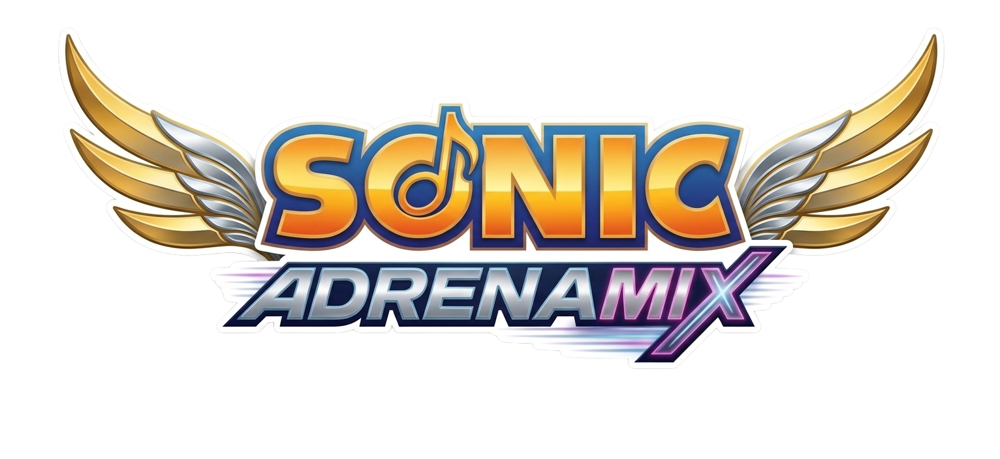

  

<h1 align="center">Sonic Adrenamix</h1>

> *Il monumento definitivo alle opere musicali di SEGA e a quelle che verranno.*

Benvenuto in **Sonic Adrenamix**! Questa non è solo un'app, è un atto d'amore puro e incondizionato verso una delle poche certezze della vita: la SEGA non sbaglia **mai** una colonna sonora.

Questa applicazione è un player musicale per Android dedicato esclusivamente all'ascolto delle OST (Original Soundtracks) dell'intero franchise di Sonic the Hedgehog. Dai beat a 16-bit del Mega Drive fino alle chitarre metal a 8 corde delle titaniche boss fight di *Sonic Frontiers*.

## ⚙️ Come Funziona
L'app è stata progettata per essere veloce, bella da vedere e, soprattutto, funzionale offline.
- **Estrazione e Download:** Scegli un gioco dalla maestosa libreria visiva. L'app si connette sotto banco a YouTube, estrae l'intera playlist ufficiale e inizia a scaricare i file audio e le copertine sul tuo dispositivo in background.
- **Player Integrato:** Un riproduttore musicale custom, interamente tematizzato con i colori e i riflessi di Sonic (Sonic Gold, Sega Blue, Neon Orange).
- **Preferiti:** Trovi la traccia della vita? Clicca sul cuore. Verrà spedita dritta nella tua playlist dei Preferiti personale, accessibile direttamente dalla schermata iniziale.
- **Offline First:** Una volta scaricati, i brani sono tuoi. Niente buffering, niente consumi dati inutili. Puoi ascoltare *Live and Learn* in metropolitana, in aereo o sulla Luna.

---

## 🏆 Credits

Quest'app non esisterebbe senza il lavoro colossale di alcune community e creatori. Un ringraziamento enorme e d'obbligo va a loro:

### 🎵 Le Playlist (YouTuber e Archiviatori)
L'app estrae l'audio direttamente da YouTube. Un grazie infinito ai seguenti canali che hanno speso migliaia di ore per preservare, catalogare e caricare questa eredità con una qualità audio impeccabile:
- **[DeoxysPrime](https://www.youtube.com/@DeoxysPrime):** Il re indiscusso. Il 90% delle playlist presenti in questa app proviene dal suo canale. Se sei un fan delle OST dei videogiochi, conosci già questo eroe senza mantello.
- **[BrawlBRSTMs3 X Archive](https://www.youtube.com/@BrawlBRSTMs3XArchive) e affiliati:** Archivi leggendari per chicche più introvabili (come *Tails Adventure* e *Sonic Colors DS*).
- **Altre Leggende:** Ringrazio di cuore anche i curatori delle OST dei giochi Mobile e Spin-off (come Dash, Runners, Dream Team) che ci permettono di non perdere questi brani assurdi.

### 🖼️ Le Immagini e le Copertine
Assolutamente tutte le grafiche spettacolari, le "Grid Art" e i banner dei singoli giochi che vedi nell'app sono stati presi da:
- **[SteamGridDB](https://www.steamgriddb.com/):** Il miglior sito sulla faccia della terra per le copertine custom. Un ringraziamento gigantesco a tutti gli artisti della community che dedicano il loro tempo a creare questi poster meravigliosi. L'app non sarebbe così bella senza il vostro lavoro.

---

## 🎁 BONUS: Il Processo Creativo

*Ovvero: perché ci ho messo tutta questa emotività.*

Se vi state chiedendo perché ci sia così tanta roba e perché ci ho speso così tanto tempo... beh, vi spiego tutto. Quando ho iniziato a selezionare i giochi per questa app, volevo fare una cosa semplice. Ma poi mi è letteralmente esploso il cuore. Ho cominciato a inserire i link e, all'improvviso, mi sono ritrovato a fare un viaggio nei ricordi. Ho riversato tutto il mio amore per questo franchise direttamente nel codice. Ecco come è andata la scelta:

**I Classici Intoccabili (Sonic 1, 2, 3&K, CD)**
Dovevo per forza partire da qui. *Green Hill* e *Chemical Plant* mi hanno svezzato. Su *Sonic CD* ho avuto un sacco di ripensamenti (meglio la OST USA o quella Jap?), ma l'importante era far respirare quell'aria da anni '90. Mentre sistemavo la UI, in testa mi girava solo il beat di *Stardust Speedway*.

**L'Era Dreamcast e GameCube (Adventure 1 & 2, Heroes, Shadow)**
Qui è dove le cose si fanno serie. I Crush 40. *Live and Learn*. *Escape from the City*. Serve aggiungere altro? Qui i Crush 40 ci hanno insegnato a fare rock, e non potevo assolutamente lasciarli fuori, così come le atmosfere skate-punk o le chitarre tamarre di Shadow the Hedgehog. E *Knuckles' Chaotix*? Una perla jazz/funk che la gente *deve* ascoltare.

**La "Dark Era" (Sonic 06, Unleashed, Black Knight, Secret Rings)**
Possiamo e dobbiamo dire quello che vogliamo sui bug di *Sonic 06* e sui problemi di quell'era, ma *His World*? La colonna sonora orchestrale pazzesca di *Unleashed* (Spagonia di notte vi dice nulla?) o i ritmi arabeggianti dei *Secret Rings*? Capolavori assoluti. Mentre lo codificavo mi sono detto: *"La gente deve ascoltare questa roba e basta, separata dal gameplay"*.

**Il Boost, L'Era Moderna e gli Spin-off (Colors, Generations, Frontiers, Rush, Riders)**
Quando sono arrivato a *Frontiers* ho avuto i brividi. Tomoya Ohtani ha letteralmente cucinato pesantemente con quelle boss fight metalcore e le atmosfere malinconiche dell'open zone. Non potevo poi tralasciare *Sonic Rush* (Hideki Naganuma sei un genio) e i *Sonic Riders* con la loro elettronica Y2K impazzita. 

**I Giochi Mobile (Dash, Runners, Forces Speed Battle)**
Sì, ho messo anche questi. Perché? Perché perfino quando SEGA fa un giochino per cellulare in cui corri all'infinito, ci butta dentro delle hit clamorose che non hanno alcun diritto di essere così belle. 

Insomma, alla fine non stavo più programmando. Stavo costruendo un santuario. Questo è il mio tributo definitivo a tutti quei compositori (Jun Senoue, Tomoya Ohtani, Richard Jacques, Tee Lopes e mille altri) che hanno fatto da colonna sonora alla mia, e alla nostra, vita.
